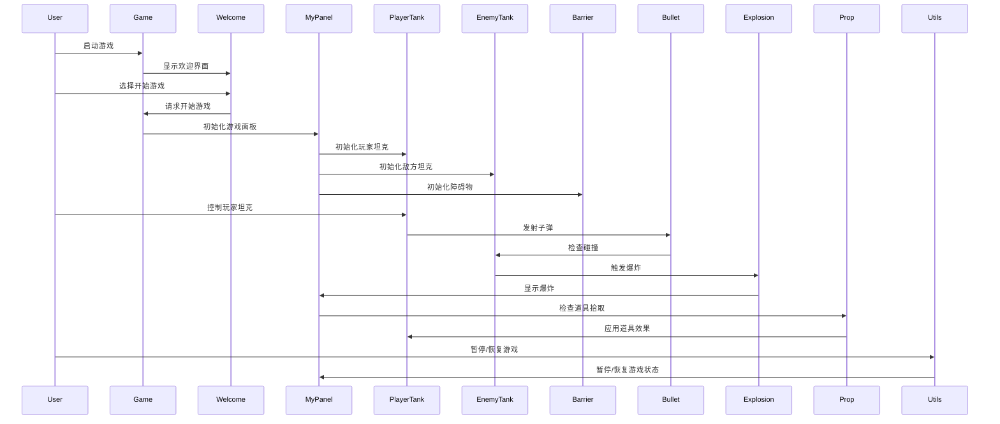

# 坦克大战
## **项目名称**

坦克大战游戏

## **项目组分工**

项目2组，成员为郭晓强，彭磊，陈锦东。分工如下：

- 郭晓强：功能主逻辑

- 彭磊：游戏部件设计

- 陈锦东:游戏界面主控设计

## **项目功能分析**

坦克大战的主要功能模块如图1所示：

图1功能模块结构图

1.界面系统:

(1) 开始菜单界面: 

基本功能：这是用户开始游戏时遇到的第一个界面，它包括开始游戏和退出选项。

备选功能：加入双人游戏模式。

(2)游戏关卡界面: 

基本功能：这是游戏的主要界面，会根据不同的关卡显示不同的地图，显示当前游戏状态，如用户的坦克、NPC坦克、血量等。

备选功能：彩蛋，输入秘籍获得30条命。

(3) 过场界面: 

基本功能：在通过一关时，会显示的界面，可以用来提供故事线索或者简单的休息。

(5) 失败结算界面: 

基本功能：当玩家失去所有生命或者基地被摧毁时，会显示该界面，显示总得分和重新开始游戏的选项。

(6) 胜利结算界面: 

基本功能：当玩家成功通过关卡或者完成所有目标时，会显示该界面，显示总得分和退出游戏的选项。

2\.对战系统:

(1) 控制移动: 

基本功能：允许玩家通过键盘的上下左右键控制坦克的上下左右移动，空格键控制发射子弹的功能，让玩家攻击敌人。

(2) 碰撞检测: 

基本功能：检测坦克与坦克、坦克与地形、子弹与坦克等的碰撞，以确定是否应对坦克造成伤害或者阻止坦克的行进。

(3) 血量显示:

基本功能： 跟踪和显示玩家和NPC的血量。

(4) 胜负判断: 

基本功能：当玩家摧毁全部敌人时游戏胜利，当玩家死亡或基地被摧毁时失败。

(5) 得分统计: 

基本功能：记录玩家击败NPC的数量和分数。

(6) 道具加成: 

基本功能：允许玩家获取能够恢复血量、提高移动速度或攻击力等的道具。

## **项目UI设计**

**1）UI界面1**

（1）UI设计原图（可简单手绘等，拍照，并注明完成人）

图1 游戏主界面UI（陈锦东完成）

（2）UI布局思想：

这个UI布局思想是使用绝对布局（null布局），使用JFrame作为顶层容器，JPanel作为中间容器，用于放置其他控件。在JFrame中，使用setTitle()、setSize()、setLayout()、setLocationRelativeTo()、setDefaultCloseOperation()、setIconImage()、setResizable()等方法来设置窗口的标题、大小、布局、位置、关闭操作、图标、是否可调整大小等属性。在JPanel中，使用setLayout()、add()、setBounds()、setFont()、setFocusPainted()、setForeground()、setContentAreaFilled()、addActionListener()等方法来设置布局、添加控件、设置控件的位置、字体、焦点、前景色、背景色、事件监听器等属性。所需控件包括JButton、JLabel等，用于显示文本和响应用户的操作。通过调用各种方法来实现游戏的各种功能，包括欢迎界面、游戏界面、游戏结束界面、游戏胜利界面、下一关界面等。

**2）UI界面2**

（1）UI设计原图（可简单手绘等，拍照，并注明完成人）

图2 暂停界面UI（陈锦东完成）

（2）UI布局思想：描述最外层的顶层布局、中间容器的布局，所需控件等

这个UI布局思想是使用绝对布局（null布局）。使用了JDialog作为弹出窗口，JPanel作为中间容器，用于放置其他控件。在JPanel中，使用了null布局来手动设置组件的位置和大小。所需控件包括JLabel、JButton等，用于显示文本和响应用户的操作。当用户点击暂停按钮时，会弹出一个JDialog窗口，其中包含两个JButton，分别用于继续游戏和返回主菜单。这两个按钮都可以通过鼠标或键盘进行操作，当用户点击其中一个按钮时，会执行相应的操作并关闭JDialog窗口。

**3）UI界面3**

（1）UI设计原图

图3 游戏界面UI（郭晓强完成）

（2）UI布局思想：描述最外层的顶层布局、中间容器的布局，所需控件等

这个UI布局继承自Jpanel，重写了paintComponent方法。该方法用于绘制游戏中的各种元素，包括背景、坦克、子弹、爆炸、buff、障碍物等。在该方法中，使用了Toolkit类的getDefaultToolkit方法获取默认工具包，以加载游戏中的图片资源。此外，该UI还包括了一些游戏逻辑，例如坦克的移动、开火、死亡等，以及一些游戏状态的更新，例如分数、剩余敌人数等。

## **项目类图设计**

1. **项目所需类的列表及简单描述**

表1 系统包结构说明

|序号|类名|描述|
| :-: | :-: | :-: |
|1|Game|界面主控类（父类为JFrame）（陈锦东完成）|
|2|Welcome|欢迎界面类（父类为JPanel）（陈锦东完成）|
|3|MyPanel|游戏界面类（父类为JPanel）（郭晓强完成）|
|4|Tank|坦克（彭磊完成）|
|5|PlayerTank|玩家（父类为Tank）（彭磊完成）|
|6|EnemyTank|敌人（父类为Tank）（彭磊完成）|
|7|AttackCallable|攻击回调（接口）（郭晓强完成）|
|8|Barrier|障碍物（郭晓强完成）|
|9|Birth|出生点（郭晓强完成）|
|10|Bullet|子弹（彭磊完成）|
|11|Explosion|爆炸（彭磊完成）|
|12|Prop|道具（陈锦东完成）|
|13|Utils|碰撞检测（陈锦东完成）|

**2）UML类图**

图4 Game类图设计（陈锦东完成）

图5 Welcome类图设计（陈锦东完成）

图6 MyPanel类图设计（郭晓强完成）

图7 Tank图设计（彭磊完成）

图8 PlayerTank类图设计（彭磊完成）

图9 EnemyTank类图设计（彭磊完成）

图10 AttackCabbable接口图设计（郭晓强完成）

图11 Barrier类图设计（郭晓强完成）

图12 Birth类图设计（郭晓强完成）

图13 Bullet类图设计（彭磊完成）

图14 Explosion类图设计（彭磊完成）

图15 Prop类图设计（陈锦东完成）

图16 Utils类图设计（陈锦东完成）

**3）全局类图**

图17 系统全局类图设计（郭晓强完成）

## **项目时序图设计**

**1）坦克大战主界面时序图设计**

图18 游戏时序图设计（郭晓强完成）

## **项目实现**

**1）系统层次架构**

系统工程结构如下图所示：

图19 系统工程结构图

系统包结构如下表所示：

表2 系统包结构说明

|**Packet**|**Class**|**功能说明**|**实现人**|
| :-: | :-: | :-: | :-: |
|drawable|无|资源文件||
|model|AttackCallable|攻击接口回调|郭晓强|
|model|Barrier|障碍物|郭晓强|
|model|Birth|出生点|郭晓强|
|model|Bullet|子弹|彭磊|
|model|Const|各种常量||
|model|EnemyTank|敌军坦克|彭磊|
|model|Explosion|绘制爆炸效果|彭磊|
|model|Game|游戏界面主控|陈锦东|
|model|MyPanel|游戏主界面|郭晓强|
|model|PlayerTank|玩家坦克|彭磊|
|model|Porp|游戏道具|陈锦东|
|model|Tank|坦克类|彭磊|
|model|Utils|碰撞检测|陈锦东|
|model|Welcome|开始界面|陈锦东|
|map|无|地图||

**2）功能模块实现**

（1）项目所需要的技术

   **Git管理，Swing框架，数据结构与算法**

## **项目运行结果**

**1）欢迎界面模块实现**

图20 欢迎界面实现截图

**2）游戏界面实现**

图21 游戏界面1实现截图

图22 游戏界面2实现截图

**3）暂停界面实现**

图23 暂停界面实现截图

**4）胜利界面实现**

图24 胜利界面实现截图

**4）失败界面实现**

图25 失败界面实现截图

